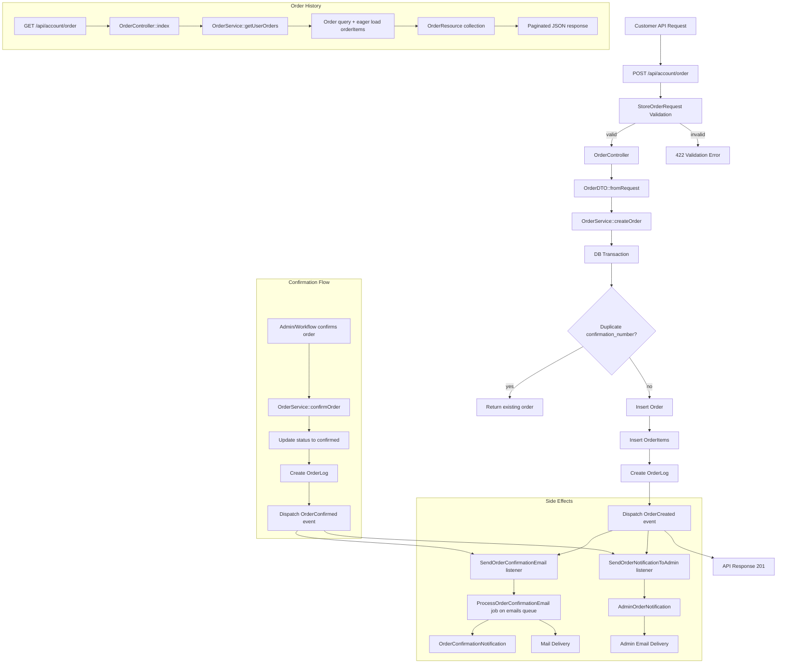

# Order Workflow Architecture

## Mermaid Diagram

## Notes

- Order creation runs inside a database transaction.
- Duplicate prevention uses `confirmation_number`.
- Notifications are asynchronous through queue jobs.
- Order history eagerly loads items to avoid N+1 queries.
